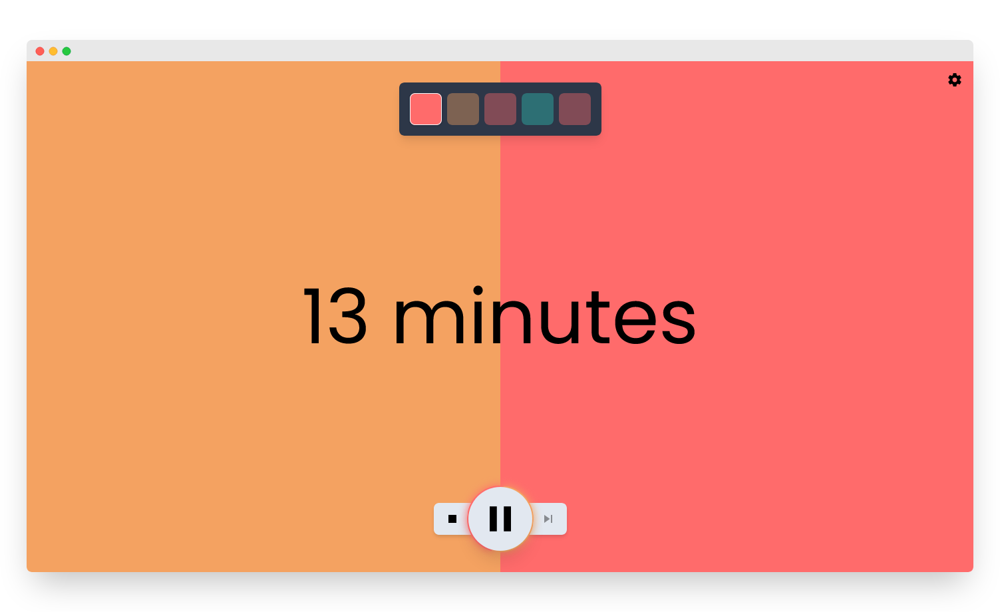

# ⏳ AnotherPomodoro

Free and open-source Pomodoro application, right in your browser.




## What is it?

AnotherPomodoro is a very creatively named Pomodoro timer application running in the browser. It helps you manage your time so that you can spend more time doing work in exchange for time spent on watching videos of cute cats 😿

### Quickstart: your schedule

When working with AnotherPomodoro, you'll be moving between three types of sections:

1. ▶ Work. <br> Do what you gotta do.
2. ⏸ (Short) Pause. <br> Take a short rest, stand up from your computer and drink some water.
3. ⏸ Long pause. <br> Having worked some time now, take a longer break. You can grab a cup of coffee, watch some memes and scroll social media.

Typically, every third break will be a long one. With the default settings that means:

1. 25 minutes of work
2. 5 minutes short pause
3. 25 minutes of work
4. 5 minutes short pause
5. 25 minutes of work
6. **15 minutes long pause**

  > 💡 **Tip**. You can customize the frequency of long pauses!

### What you get

* ⏰ **Multiple types of timers**
  * (12:34) _traditional_ <br> a classic one with second-precision for those who want to know exactly how much time is left until coffee break
  * (12 minutes) _approximate_ <br> this one displays time in minute-precision so you know how much time is left but your eyes won't stick to the counter since it does not change every second
  * (50%) _percentage_ <br> this one is even less informative, keeping you away from the distraction of calculating "what can I do in the remaining 12 minutes and 34 seconds?".
* 💡 **Friendly, focused and clean user interface**
  * a timer in the center, a quick glance of your schedule at the top and controls at the bottom. What else?
  * fancy and colourful progress bar in the background
* 📑 **Flexible schedule**
  * adjust the length of your sessions separately or use one of the built-in presets
  * set how frequent long breaks are
* 🎵 **Multiple ways to notify you**
  * play sounds when you finish a section
  * desktop notifications so you don't have to keep checking your browser
* ⚙ **Plenty of options**
  * set your schedule the way you want it
  * hide the schedule or the progress bar
  * enable/disable audio and/or desktop notifications
  * change number of schedule items
  * control your timer using the keyboard
  * ... and more to come in the future!
* 📑 **Flexible task list**
  * set separate tasks for work, pause and long pause sections
  * only shows your top _n_ relevant tasks while the timer is running
  * remembers your tasks across sessions
* ✨ **Other nice-to-have features**
  * remembers your settings
  * _adaptive ticking_: timers will update less frequently while the browser tab is not visible
  * it's a _PWA_ (Progressive Web App): it's fast and you can "install" it through your browser!
  * has some nice animations :)
* ✔ **No installation required**. Just open the webpage and enjoy it!
* 📵 **No tracking, ads or any fishy stuff -- and it's entirely _free_**
* 👋 **Open development**
  * anyone can view the source code, raise issues (feature requests, bug reports) or even submit their own improvements!

### ⚠ Transparency warning
Production deployments are currently using the open-source and privacy-friendly [Plausible Analytics](https://plausible.io) to measure site performance.
This will likely change in the close future to make the deployed web app entirely free of tracking.

Plausible does not collect personal data nor does it track visitors across sites and is fully GDPR-compliant! Visit their website for more info.
The app itself still does not collect any data (eg. when you're running it on your own machine) 💪

## 🏗 For other developers

### ❤ Technologies, packages used

* [**NuxtJS**](https://nuxtjs.org/) (and thus [**VueJS**](https://vuejs.org/))
  * [`nuxt-i18n`](https://i18n.nuxtjs.org/) (and thus [`vue-i18n`](https://kazupon.github.io/vue-i18n/)) for localization
  * [`nuxt/google-fonts`](https://github.com/nuxt-community/google-fonts-module) for Google Fonts support
  * [`nuxt/pwa`](https://pwa.nuxtjs.org/) for PWA (Progressive Web Apps) support
  * [`vue-native-notification`](https://github.com/dennisbruner/vue-native-notification) for easier notifications support
  * [`vuex-persistedstate`](https://github.com/robinvdvleuten/vuex-persistedstate) for store persistence
  * [Vue Lazy Hydration](https://github.com/maoberlehner/vue-lazy-hydration) (`vue-lazy-hydration`)
  * [Vuelidate](https://vuelidate.js.org/) for input validation (`vuelidate`)
  * [`@aceforth/nuxt-optimized-images`](https://marquez.co/docs/nuxt-optimized-images) for automatic build-time image optimization
* [**Tailwind CSS**](https://tailwindcss.com/)
  * [`@tailwindcss/forms`](https://github.com/tailwindlabs/tailwindcss-forms)
* [Tabler Icons](https://tabler-icons.io/) through [`vue-tabler-icons`](https://github.com/alex-oleshkevich/vue-tabler-icons)
* [DayJS](https://day.js.org/) for time formatting
* [`conventional-changelog/standard-version`](https://github.com/conventional-changelog/standard-version) for automatic changelog generation from [conventional commits](https://www.conventionalcommits.org/en/v1.0.0/)

### 🛠 Building the app yourself

```bash
# install dependencies
$ yarn install

# serve with hot reload at localhost:3000
$ yarn dev

# generate the final static site
$ yarn generate
```
