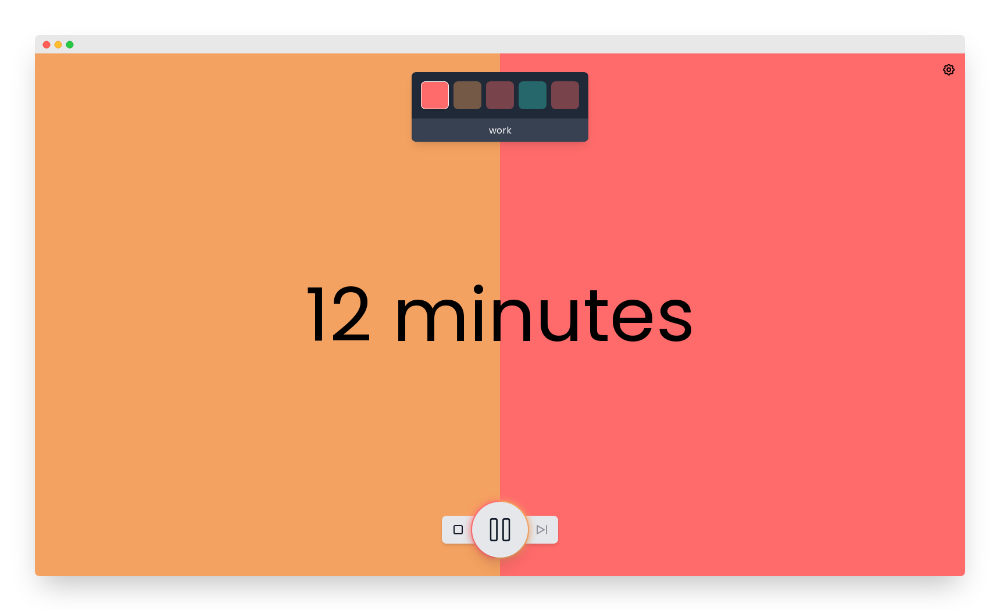
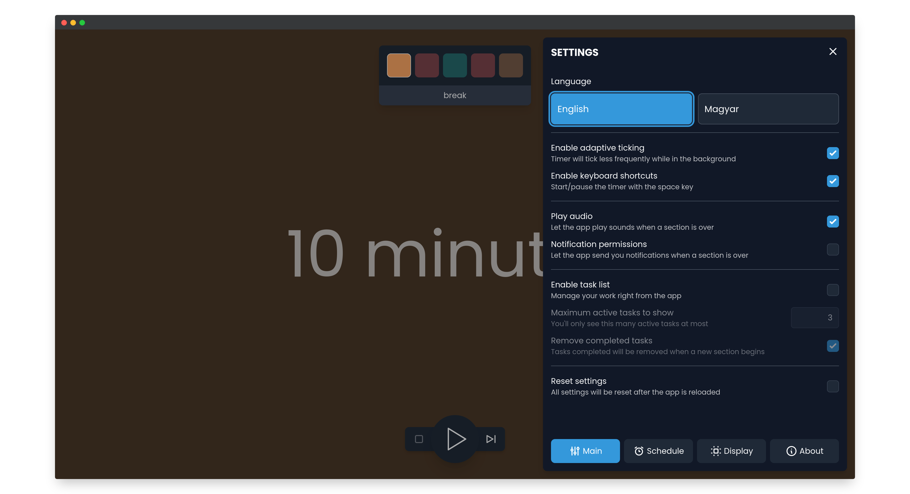
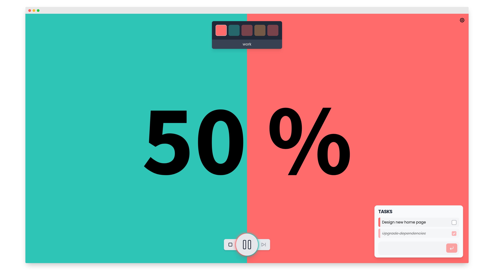

# ⏳ AnotherPomodoro

Free and open-source Pomodoro application, right in your browser.

[](https://www.buymeacoffee.com/imreg?utm_source=github&utm_medium=web&utm_content=readme) <a href="https://www.producthunt.com/posts/anotherpomodoro?utm_source=badge-featured&utm_medium=badge&utm_souce=badge-anotherpomodoro" target="_blank"></a>




## What is it?

AnotherPomodoro is a Pomodoro timer application running in the browser. It helps you manage your time so that you can do more work instead of watching videos of cute cats 😿

### Quickstart: your schedule

When working with AnotherPomodoro, you'll be moving between three types of sessions:

1. **Work**. <br> Do what you have to do.
2. (Short) **Pause**. <br> Take a short rest, stand up from your computer and drink some water.
3. **Long pause**. <br> Having worked some time now, take a longer break. You can grab a cup of coffee, watch some memes and scroll social media.

With the default Pomodoro settings, every third break will be a long one.

  > 💡 **Tip**. You can customize the length of the timers and the frequency of long pauses, too!

## What you get

Here's the looong list of features this app includes.

* ⏰ **Multiple timer styles**
  * (12:34) _traditional_ <br> a classic one with second-precision for those who want to know exactly how much time is left until coffee break
  * (12 minutes) _approximate_ <br> this one displays time with minute-precision so you know how much time is left but your eyes won't stick to the counter since it does not change every second
  * (50%) _percentage_ <br> being even less informative, this one keeps you away from the distraction of calculating "what can I do in the remaining 12 minutes and 34 seconds?".
* 💡 **Friendly, focused and clean user interface**
  * the essentials: a timer in the middle and controls at the bottom. The rest can be turned off:
    * a quick glance at your schedule at the top
    * a smart to-do list
    * fancy and colourful progress bar in the background
* 📑 **Flexible schedule**
  * adjust the length of your sessions separately or use one of the built-in presets
  * set how frequent long pauses are
* 🎵 **Multiple ways to notify you**
  * play sounds when you finish a section
  * desktop notifications so you don't have to keep checking your browser
* ⚙ **Plenty of options**
  * set your schedule the way you want it
  * hide the schedule, the progress bar or the to-do list
  * enable/disable audio and/or desktop notifications
  * change the number of schedule items shown
  * control your timer using the keyboard
  * dark and light themes
  * ... and more to come in the future!
* ✅ **Clean to-do list**
  * set separate tasks for work, pause and long pause sections
  * only shows your top relevant tasks while the timer is running
  * automatically remove completed tasks at the end of each session
  * remembers your tasks across sessions
* ✨ **Other nice-to-have features**
  * remembers your settings
  * _adaptive ticking_: timers will update less frequently while the browser tab is not visible
  * it's a _PWA_ (Progressive Web App): it's fast and you can install it through your browser!
  * fancy and fluid animations
  * setup wizard to get you started with the app
  * localisations
  * helpful error pages
  * automatically advance sections
* ✔ **No installation required**. Just open the webpage and enjoy it! You can even self-host it!
* 📵 **No tracking, ads or any fishy stuff -- and it's entirely _free_**
* 👋 **Open development**
  * anyone can view the source code, raise issues (feature requests, bug reports) or even submit their own improvements!

### ⚠ Transparency warning
Production deployments (on Netlify or elsewhere) may use third-party tools (like Plausible Analytics or FairAnalytics) to measure site performance.

The app itself still does not collect any data (eg. when you're running it on your own machine) 💪

## 🖼 More screenshots



## 🏗 If you're a developer

This is an open-source project that welcomes contributions. Please check the [**contribution guidelines**](./CONTRIBUTING.md) before opening issues, discussions or pull requests!

### ❤ Technologies, packages used

* [**NuxtJS**](https://nuxtjs.org/) (and thus [**VueJS**](https://vuejs.org/))
  * [`nuxt-i18n`](https://i18n.nuxtjs.org/) (and thus [`vue-i18n`](https://kazupon.github.io/vue-i18n/)) for localization
  * [`nuxt/google-fonts`](https://github.com/nuxt-community/google-fonts-module) for Google Fonts support
  * [`nuxt/pwa`](https://pwa.nuxtjs.org/) for PWA (Progressive Web Apps) support
  * [`vue-native-notification`](https://github.com/dennisbruner/vue-native-notification) for easier notifications support
  * [`vuex-persistedstate`](https://github.com/robinvdvleuten/vuex-persistedstate) for store persistence
  * [Vuelidate](https://vuelidate.js.org/) for input validation (`vuelidate`)
  * [`@nuxt/image`](https://image.nuxtjs.org/) for automatic image optimization
* [**Tailwind CSS**](https://tailwindcss.com/)
  * [`@tailwindcss/forms`](https://github.com/tailwindlabs/tailwindcss-forms)
* [Tabler Icons](https://tabler-icons.io/) through [`vue-tabler-icons`](https://github.com/alex-oleshkevich/vue-tabler-icons)
* [DayJS](https://day.js.org/) for time formatting
* [`conventional-changelog/standard-version`](https://github.com/conventional-changelog/standard-version) for automatic changelog generation from [conventional commits](https://www.conventionalcommits.org/en/v1.0.0/)

### 🛠 Building or running the app yourself

```bash
# install dependencies
$ yarn install

# serve with hot reload at localhost:3000
$ yarn dev

# generate the final static site
$ yarn generate
```

## ☕ Support the project

If you like this project or it has helped you, please consider buying the maintainer a coffee. You won't be annoyed to do so while using the app!

<p align="center"><a href="https://www.producthunt.com/posts/anotherpomodoro?utm_source=badge-featured&utm_medium=badge&utm_souce=badge-anotherpomodoro" target="_blank"></a></p>

[<p align="center"></p>](https://www.buymeacoffee.com/imreg?utm_source=github&utm_medium=web&utm_content=readme)
